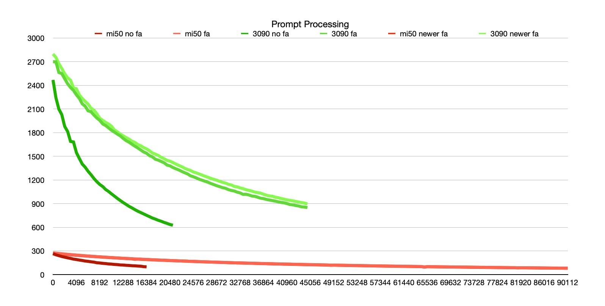
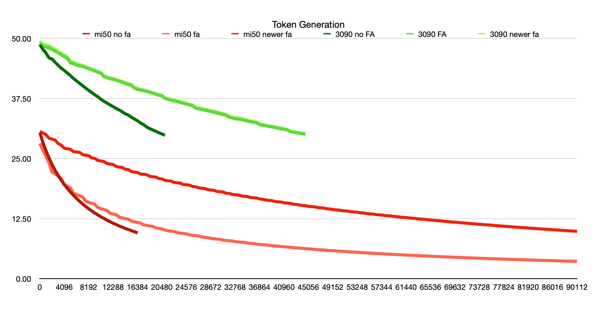

# MI50 vs 3090

Everyone knows the MI50 is slow, and the 3090 is significantly more powerful. This, and the fact it has CUDA, is why a single 3090 cost as much as all 8 of my MI50s.

But how much slower is it actually? I've tested the 3090 and MI50 running a 15B model. And has the gap been closed by [recent performance improvements](performance-updates.md)?

# The Numbers

<details>
<summary>Results chart (lots of numbers)</summary>

| |mi50 no fa| |mi50 fa |  |mi50 newer FA|  |3090 no fa|  |3090 fa | |3090 newer fa| |
|------|----------|------|--------|--------|-------------|--------|----------|--------|--------|--------|-------------|--------|
|N_KV  |S_PP t/s  |S_TG t/s|S_PP t/s|S_TG t/s|S_PP t/s     |S_TG t/s|S_PP t/s  |S_TG t/s|S_PP t/s|S_TG t/s|S_PP t/s     |S_TG t/s|
|0     |264.77    |30.37 |274.66  |28.13   |270.18       |30.62   |2467.72   |48.69   |2698.47 |48.93   |2796.13      |49.40   |
|512   |250.68    |28.35 |271.20  |26.79   |267.01       |30.33   |2241.78   |47.72   |2697.35 |48.23   |2753.77      |48.71   |
|1024  |239.96    |26.62 |267.41  |25.45   |263.68       |29.99   |2098.18   |46.94   |2562.06 |48.22   |2673.28      |48.66   |
|1536  |229.07    |25.13 |263.84  |24.08   |260.28       |29.23   |2028.40   |45.92   |2547.94 |47.96   |2613.40      |48.43   |
|2048  |220.72    |23.74 |260.46  |22.18   |256.79       |29.05   |1878.32   |45.69   |2483.23 |47.66   |2544.90      |48.09   |
|2560  |212.08    |22.56 |256.83  |21.80   |253.74       |28.85   |1814.70   |45.02   |2420.21 |47.34   |2494.53      |47.73   |
|3072  |204.94    |21.47 |253.46  |21.33   |250.61       |28.13   |1688.23   |44.39   |2371.61 |46.95   |2464.75      |47.31   |
|3584  |196.02    |20.51 |250.13  |20.87   |247.67       |27.80   |1681.46   |43.79   |2335.07 |46.59   |2367.36      |46.95   |
|4096  |191.03    |19.60 |247.32  |19.58   |244.81       |27.16   |1547.37   |43.33   |2279.19 |46.19   |2355.15      |46.53   |
|4608  |184.00    |18.81 |244.25  |19.25   |241.69       |27.04   |1472.74   |42.79   |2233.87 |45.83   |2277.42      |46.14   |
|5120  |178.75    |18.04 |241.38  |18.91   |239.11       |26.93   |1401.46   |42.27   |2164.33 |44.87   |2233.07      |45.17   |
|5632  |171.61    |17.37 |238.28  |17.82   |236.44       |26.45   |1361.19   |41.65   |2134.35 |44.74   |2195.86      |45.04   |
|6144  |167.80    |16.71 |235.56  |17.54   |233.56       |26.37   |1309.57   |41.16   |2076.14 |44.43   |2162.03      |44.71   |
|6656  |162.02    |16.13 |232.97  |17.28   |231.05       |26.29   |1266.51   |40.65   |2064.81 |44.26   |2108.63      |44.56   |
|7168  |157.91    |15.56 |230.21  |17.01   |228.54       |25.82   |1218.35   |40.17   |2022.09 |44.10   |2084.10      |44.36   |
|7680  |149.85    |15.06 |227.46  |16.19   |225.69       |25.71   |1177.67   |39.65   |1984.13 |43.90   |2038.64      |44.15   |
|8192  |146.97    |14.56 |225.20  |15.91   |223.57       |25.60   |1142.28   |39.17   |1955.15 |43.66   |1981.20      |43.89   |
|8704  |142.31    |14.12 |222.74  |15.70   |220.95       |25.13   |1116.47   |38.73   |1909.81 |43.43   |1955.22      |43.63   |
|9216  |139.39    |13.68 |220.33  |15.48   |218.82       |25.03   |1078.72   |38.27   |1889.18 |43.20   |1929.61      |43.38   |
|9728  |134.67    |13.29 |217.97  |14.81   |216.08       |24.62   |1053.62   |37.84   |1860.38 |42.94   |1909.16      |43.12   |
|10240 |132.51    |12.89 |215.61  |14.58   |214.35       |24.49   |1023.50   |37.34   |1829.43 |42.73   |1881.33      |42.90   |
|10752 |128.65    |12.55 |213.40  |14.41   |212.03       |24.39   |995.14    |36.92   |1806.52 |42.05   |1833.31      |42.22   |
|11264 |126.39    |12.19 |211.13  |14.21   |209.98       |23.97   |965.64    |36.54   |1780.80 |41.80   |1810.22      |41.97   |
|11776 |122.16    |11.88 |209.02  |13.64   |207.45       |23.86   |939.34    |36.15   |1758.65 |41.59   |1781.10      |41.76   |
|12288 |120.79    |11.56 |207.01  |13.46   |205.74       |23.77   |912.94    |35.80   |1726.24 |41.48   |1759.43      |41.63   |
|12800 |117.47    |11.28 |205.03  |13.32   |203.66       |23.36   |889.79    |35.42   |1698.20 |41.28   |1736.86      |41.47   |
|13312 |115.57    |10.99 |202.98  |12.84   |201.78       |23.24   |864.86    |35.11   |1678.11 |41.07   |1716.49      |41.26   |
|13824 |112.34    |10.74 |201.02  |12.66   |199.44       |23.16   |845.65    |34.72   |1652.52 |40.85   |1690.75      |41.03   |
|14336 |110.85    |10.47 |198.98  |12.52   |194.61       |22.78   |823.34    |34.31   |1627.88 |40.61   |1675.61      |40.80   |
|14848 |107.93    |10.25 |197.20  |12.39   |195.83       |22.70   |803.61    |34.03   |1605.21 |40.42   |1648.82      |40.57   |
|15360 |106.23    |10.01 |195.27  |11.99   |194.17       |22.30   |786.26    |33.60   |1579.90 |40.20   |1632.47      |40.37   |
|15872 |100.14    |9.80  |193.00  |11.82   |191.42       |22.18   |769.07    |33.22   |1554.49 |39.62   |1610.91      |39.78   |
|16384 |98.22     |9.54  |191.66  |11.71   |190.56       |22.11   |751.13    |32.86   |1538.24 |39.39   |1593.10      |39.60   |
|16896 |          |      |190.05  |11.59   |188.76       |21.78   |734.49    |32.39   |1507.52 |39.24   |1570.02      |39.35   |
|17408 |          |      |188.17  |11.24   |186.36       |21.72   |716.40    |32.06   |1492.27 |39.11   |1541.49      |39.27   |
|17920 |          |      |186.51  |11.10   |185.21       |21.64   |703.62    |31.56   |1462.39 |38.95   |1527.16      |39.11   |
|18432 |          |      |184.67  |11.00   |183.98       |21.32   |688.12    |31.23   |1450.50 |38.75   |1509.99      |38.92   |
|18944 |          |      |183.18  |10.90   |182.25       |21.22   |676.08    |30.95   |1433.94 |38.56   |1486.07      |38.71   |
|19456 |          |      |181.55  |10.58   |180.87       |21.15   |661.23    |30.68   |1416.64 |38.35   |1468.54      |38.52   |
|19968 |          |      |179.85  |10.47   |179.04       |20.84   |648.89    |30.38   |1388.50 |38.17   |1447.60      |38.33   |
|20480 |          |      |178.32  |10.39   |177.80       |20.76   |635.05    |30.10   |1378.29 |37.98   |1438.09      |38.15   |
|20992 |          |      |176.81  |10.13   |176.23       |20.48   |625.77    |29.84   |1357.85 |37.49   |1420.43      |37.65   |
|21504 |          |      |175.26  |10.00   |175.00       |20.38   |          |        |1341.28 |37.31   |1401.33      |37.45   |
|22016 |          |      |173.93  |9.91    |173.26       |20.32   |          |        |1326.81 |37.16   |1383.89      |37.30   |
|22528 |          |      |172.27  |9.84    |172.11       |20.04   |          |        |1308.56 |36.97   |1368.87      |37.16   |
|23040 |          |      |171.08  |9.61    |170.68       |19.96   |          |        |1291.03 |36.86   |1348.15      |37.01   |
|23552 |          |      |169.39  |9.50    |169.34       |19.89   |          |        |1276.59 |36.69   |1333.01      |36.85   |
|24064 |          |      |167.85  |9.42    |167.30       |19.61   |          |        |1252.57 |36.49   |1319.87      |36.67   |
|24576 |          |      |166.80  |9.36    |166.64       |19.55   |          |        |1240.24 |36.33   |1300.82      |36.49   |
|25088 |          |      |165.56  |9.13    |165.26       |19.48   |          |        |1225.33 |36.14   |1289.33      |36.31   |
|25600 |          |      |164.12  |9.04    |164.06       |19.21   |          |        |1208.09 |35.98   |1275.88      |36.15   |
|26112 |          |      |163.01  |8.98    |162.23       |19.14   |          |        |1195.97 |35.48   |1260.75      |35.68   |
|26624 |          |      |161.53  |8.92    |160.97       |18.92   |          |        |1183.15 |35.35   |1246.68      |35.56   |
|27136 |          |      |160.39  |8.71    |160.06       |18.81   |          |        |1170.26 |35.16   |1233.47      |35.38   |
|27648 |          |      |159.10  |8.63    |158.84       |18.77   |          |        |1154.64 |35.05   |1219.52      |35.25   |
|28160 |          |      |157.69  |8.58    |157.32       |18.54   |          |        |1140.25 |34.93   |1206.54      |35.14   |
|28672 |          |      |156.78  |8.42    |156.44       |18.46   |          |        |1126.46 |34.76   |1196.56      |34.98   |
|29184 |          |      |155.61  |8.33    |155.23       |18.40   |          |        |1114.71 |34.61   |1182.22      |34.83   |
|29696 |          |      |154.30  |8.26    |154.02       |18.17   |          |        |1102.19 |34.47   |1169.12      |34.68   |
|30208 |          |      |153.30  |8.21    |152.75       |18.11   |          |        |1093.55 |34.29   |1160.36      |34.50   |
|30720 |          |      |152.01  |8.06    |150.98       |18.05   |          |        |1077.18 |34.14   |1143.72      |34.36   |
|31232 |          |      |151.03  |7.97    |149.91       |17.80   |          |        |1066.19 |34.00   |1136.16      |34.22   |
|31744 |          |      |149.92  |7.92    |148.72       |17.75   |          |        |1059.22 |33.56   |1117.35      |33.81   |
|32256 |          |      |147.59  |7.88    |147.68       |17.57   |          |        |1044.67 |33.45   |1111.87      |33.65   |
|32768 |          |      |147.70  |7.73    |147.11       |17.48   |          |        |1035.33 |33.27   |1098.89      |33.46   |
|33280 |          |      |146.74  |7.66    |146.13       |17.43   |          |        |1016.80 |33.21   |1089.17      |33.42   |
|33792 |          |      |145.59  |7.61    |145.02       |17.23   |          |        |1017.87 |33.08   |1076.27      |33.30   |
|34304 |          |      |144.87  |7.57    |143.96       |17.15   |          |        |1009.51 |32.96   |1067.70      |33.16   |
|34816 |          |      |143.64  |7.43    |142.94       |17.11   |          |        |996.35  |32.82   |1057.56      |32.99   |
|35328 |          |      |142.68  |7.36    |141.91       |16.91   |          |        |992.04  |32.66   |1046.17      |32.84   |
|35840 |          |      |141.58  |7.32    |140.76       |16.85   |          |        |980.71  |32.53   |1038.74      |32.71   |
|36352 |          |      |140.65  |7.23    |139.65       |16.80   |          |        |968.56  |32.40   |1032.53      |32.58   |
|36864 |          |      |139.83  |7.15    |138.86       |16.60   |          |        |962.89  |32.03   |1017.92      |32.24   |
|37376 |          |      |138.95  |7.09    |138.04       |16.55   |          |        |952.86  |31.91   |1006.24      |32.07   |
|37888 |          |      |137.94  |7.05    |136.96       |16.39   |          |        |945.36  |31.79   |996.96       |31.94   |
|38400 |          |      |137.17  |6.96    |136.08       |16.30   |          |        |938.38  |31.66   |993.96       |31.81   |
|38912 |          |      |136.13  |6.88    |135.12       |16.26   |          |        |931.17  |31.59   |980.31       |31.73   |
|39424 |          |      |135.38  |6.84    |134.28       |16.08   |          |        |922.68  |31.45   |975.26       |31.58   |
|39936 |          |      |134.32  |6.80    |133.38       |16.01   |          |        |914.63  |31.31   |963.44       |31.46   |
|40448 |          |      |132.98  |6.71    |131.96       |15.97   |          |        |909.93  |31.17   |956.30       |31.32   |
|40960 |          |      |132.71  |6.65    |131.51       |15.80   |          |        |900.75  |31.09   |946.76       |31.23   |
|41472 |          |      |131.88  |6.61    |130.73       |15.74   |          |        |888.08  |30.95   |941.11       |31.08   |
|41984 |          |      |131.04  |6.57    |129.84       |15.70   |          |        |884.57  |30.61   |934.59       |30.72   |
|42496 |          |      |130.45  |6.48    |129.04       |15.52   |          |        |875.81  |30.52   |927.66       |30.63   |
|43008 |          |      |129.35  |6.42    |128.19       |15.48   |          |        |869.69  |30.37   |920.14       |30.50   |
|43520 |          |      |128.84  |6.39    |127.39       |15.34   |          |        |858.98  |30.27   |912.58       |30.38   |
|44032 |          |      |127.81  |6.33    |126.56       |15.26   |          |        |856.26  |30.14   |906.46       |30.28   |
|44544 |          |      |126.95  |6.26    |125.58       |15.22   |          |        |849.00  |30.08   |896.57       |30.22   |
|45056 |          |      |126.16  |6.22    |124.96       |15.07   |          |        |        |        |             |        |
|45568 |          |      |125.62  |6.19    |124.15       |15.01   |          |        |        |        |             |        |
|46080 |          |      |124.62  |6.12    |123.33       |14.97   |          |        |        |        |             |        |
|46592 |          |      |124.15  |6.06    |122.59       |14.81   |          |        |        |        |             |        |
|47104 |          |      |123.20  |6.02    |121.81       |14.76   |          |        |        |        |             |        |
|47616 |          |      |122.49  |6.00    |121.13       |14.71   |          |        |        |        |             |        |
|48128 |          |      |121.85  |5.93    |120.32       |14.57   |          |        |        |        |             |        |
|48640 |          |      |119.00  |5.88    |118.09       |14.52   |          |        |        |        |             |        |
|49152 |          |      |120.42  |5.85    |118.93       |14.41   |          |        |        |        |             |        |
|49664 |          |      |119.73  |5.82    |118.27       |14.34   |          |        |        |        |             |        |
|50176 |          |      |118.94  |5.75    |117.57       |14.29   |          |        |        |        |             |        |
|50688 |          |      |118.42  |5.70    |116.87       |14.17   |          |        |        |        |             |        |
|51200 |          |      |117.54  |5.68    |116.09       |14.11   |          |        |        |        |             |        |
|51712 |          |      |116.92  |5.63    |115.50       |14.07   |          |        |        |        |             |        |
|52224 |          |      |116.23  |5.58    |114.87       |13.94   |          |        |        |        |             |        |
|52736 |          |      |115.63  |5.54    |113.97       |13.89   |          |        |        |        |             |        |
|53248 |          |      |114.86  |5.52    |113.45       |13.85   |          |        |        |        |             |        |
|53760 |          |      |114.38  |5.47    |112.84       |13.72   |          |        |        |        |             |        |
|54272 |          |      |113.61  |5.42    |112.24       |13.68   |          |        |        |        |             |        |
|54784 |          |      |113.10  |5.39    |111.53       |13.59   |          |        |        |        |             |        |
|55296 |          |      |112.32  |5.36    |110.99       |13.51   |          |        |        |        |             |        |
|55808 |          |      |111.70  |5.31    |110.35       |13.47   |          |        |        |        |             |        |
|56320 |          |      |111.19  |5.27    |109.68       |13.37   |          |        |        |        |             |        |
|56832 |          |      |110.33  |5.24    |108.77       |13.30   |          |        |        |        |             |        |
|57344 |          |      |110.03  |5.22    |108.48       |13.27   |          |        |        |        |             |        |
|57856 |          |      |109.37  |5.17    |107.89       |13.16   |          |        |        |        |             |        |
|58368 |          |      |108.64  |5.13    |107.29       |13.11   |          |        |        |        |             |        |
|58880 |          |      |108.13  |5.11    |106.77       |13.07   |          |        |        |        |             |        |
|59392 |          |      |107.49  |5.07    |106.15       |12.97   |          |        |        |        |             |        |
|59904 |          |      |106.98  |5.03    |105.52       |12.92   |          |        |        |        |             |        |
|60416 |          |      |106.39  |5.00    |105.06       |12.84   |          |        |        |        |             |        |
|60928 |          |      |105.96  |4.98    |104.27       |12.78   |          |        |        |        |             |        |
|61440 |          |      |105.32  |4.94    |103.94       |12.73   |          |        |        |        |             |        |
|61952 |          |      |104.78  |4.90    |103.41       |12.65   |          |        |        |        |             |        |
|62464 |          |      |104.15  |4.88    |102.81       |12.59   |          |        |        |        |             |        |
|62976 |          |      |103.53  |4.86    |102.29       |12.55   |          |        |        |        |             |        |
|63488 |          |      |103.16  |4.81    |101.68       |12.46   |          |        |        |        |             |        |
|64000 |          |      |102.52  |4.78    |101.20       |12.41   |          |        |        |        |             |        |
|64512 |          |      |102.04  |4.76    |100.75       |12.37   |          |        |        |        |             |        |
|65024 |          |      |96.65   |4.74    |94.78        |12.28   |          |        |        |        |             |        |
|65536 |          |      |101.00  |4.69    |99.71        |12.24   |          |        |        |        |             |        |
|66048 |          |      |100.39  |4.66    |99.15        |12.17   |          |        |        |        |             |        |
|66560 |          |      |99.87   |4.64    |98.76        |12.10   |          |        |        |        |             |        |
|67072 |          |      |99.38   |4.62    |98.26        |12.06   |          |        |        |        |             |        |
|67584 |          |      |98.88   |4.58    |97.65        |11.99   |          |        |        |        |             |        |
|68096 |          |      |98.34   |4.55    |97.30        |11.93   |          |        |        |        |             |        |
|68608 |          |      |97.90   |4.54    |96.79        |11.89   |          |        |        |        |             |        |
|69120 |          |      |97.59   |4.51    |96.12        |11.81   |          |        |        |        |             |        |
|69632 |          |      |96.88   |4.47    |95.83        |11.77   |          |        |        |        |             |        |
|70144 |          |      |96.42   |4.45    |95.40        |11.73   |          |        |        |        |             |        |
|70656 |          |      |95.98   |4.43    |94.95        |11.65   |          |        |        |        |             |        |
|71168 |          |      |95.41   |4.40    |94.45        |11.61   |          |        |        |        |             |        |
|71680 |          |      |95.10   |4.37    |93.98        |11.55   |          |        |        |        |             |        |
|72192 |          |      |94.60   |4.35    |93.58        |11.49   |          |        |        |        |             |        |
|72704 |          |      |94.16   |4.34    |93.18        |11.45   |          |        |        |        |             |        |
|73216 |          |      |93.90   |4.30    |92.40        |11.38   |          |        |        |        |             |        |
|73728 |          |      |93.24   |4.27    |92.29        |11.34   |          |        |        |        |             |        |
|74240 |          |      |92.78   |4.26    |91.83        |11.30   |          |        |        |        |             |        |
|74752 |          |      |92.43   |4.23    |91.38        |11.23   |          |        |        |        |             |        |
|75264 |          |      |91.96   |4.20    |90.95        |11.19   |          |        |        |        |             |        |
|75776 |          |      |91.54   |4.18    |90.57        |11.15   |          |        |        |        |             |        |
|76288 |          |      |91.11   |4.17    |90.07        |11.08   |          |        |        |        |             |        |
|76800 |          |      |90.77   |4.14    |89.64        |11.04   |          |        |        |        |             |        |
|77312 |          |      |90.44   |4.11    |89.09        |10.99   |          |        |        |        |             |        |
|77824 |          |      |89.82   |4.09    |88.86        |10.93   |          |        |        |        |             |        |
|78336 |          |      |89.49   |4.08    |88.53        |10.90   |          |        |        |        |             |        |
|78848 |          |      |89.08   |4.05    |88.01        |10.84   |          |        |        |        |             |        |
|79360 |          |      |88.61   |4.02    |87.63        |10.78   |          |        |        |        |             |        |
|79872 |          |      |88.25   |4.01    |87.29        |10.75   |          |        |        |        |             |        |
|80384 |          |      |87.84   |4.00    |86.87        |10.69   |          |        |        |        |             |        |
|80896 |          |      |87.54   |3.96    |86.51        |10.65   |          |        |        |        |             |        |
|81408 |          |      |85.93   |3.94    |84.55        |10.61   |          |        |        |        |             |        |
|81920 |          |      |86.79   |3.93    |85.75        |10.56   |          |        |        |        |             |        |
|82432 |          |      |86.34   |3.91    |85.41        |10.52   |          |        |        |        |             |        |
|82944 |          |      |85.90   |3.88    |84.97        |10.47   |          |        |        |        |             |        |
|83456 |          |      |85.55   |3.86    |84.62        |10.42   |          |        |        |        |             |        |
|83968 |          |      |85.20   |3.85    |84.32        |10.39   |          |        |        |        |             |        |
|84480 |          |      |84.88   |3.83    |83.88        |10.34   |          |        |        |        |             |        |
|84992 |          |      |84.51   |3.80    |83.61        |10.29   |          |        |        |        |             |        |
|85504 |          |      |84.25   |3.79    |82.98        |10.25   |          |        |        |        |             |        |
|86016 |          |      |83.77   |3.78    |82.82        |10.21   |          |        |        |        |             |        |
|86528 |          |      |83.48   |3.75    |82.51        |10.16   |          |        |        |        |             |        |
|87040 |          |      |83.09   |3.73    |82.15        |10.13   |          |        |        |        |             |        |
|87552 |          |      |82.67   |3.72    |81.70        |10.08   |          |        |        |        |             |        |
|88064 |          |      |82.30   |3.70    |81.40        |10.04   |          |        |        |        |             |        |
|88576 |          |      |82.06   |3.68    |81.09        |10.00   |          |        |        |        |             |        |
|89088 |          |      |81.79   |3.66    |80.74        |9.95    |          |        |        |        |             |        |
|89600 |          |      |81.61   |3.65    |80.15        |9.92    |          |        |        |        |             |        |
|90112 |          |      |81.09   |3.63    |80.12        |9.87    |          |        |        |        |             |        |


</details>
<br>

# Configuration

The older version is:
```
commit 1eeb523c3e0c7ffbd59469f5463dcbdecba3535e (tag: b6529, origin/master, origin/HEAD)
Author: Giuseppe Scrivano <gscrivan@redhat.com>
Date:   Sun Sep 21 08:31:55 2025 +0200
```

The newer version is:
```
commit b887d2f3413ac231e3cb5925260c39902af4a70c (origin/master, origin/HEAD)
Author: Sigbjørn Skjæret <sigbjorn.skjaeret@scala.com>
Date:   Sun Sep 28 23:15:03 2025 +0200
```

Configure arguments are:
```bash
HIPCXX="$(hipconfig -l)/clang" HIP_PATH="$(hipconfig -R)" CUDACXX="/usr/local/cuda-13.0/bin/nvcc" cmake -S . -B build -DGGML_HIP=ON -DAMDGPU_TARGETS=gfx906 -DCMAKE_BUILD_TYPE=Release -DGGML_RPC=ON -DLLAMA_CURL=OFF -DGGML_CUDA=ON -DGGML_BACKEND_DL=ON -DGGML_CPU_ALL_VARIANTS=ON -DCMAKE_CUDA_ARCHITECTURES=86 -DGGML_CUDA_FA_ALL_QUANTS=true -DGGML_SCHED_MAX_COPIES=1
```

# Graph

## Prompt Processing:


There's not much of a competetition here. The MI50 is simply a lot slower. The performance improvements aren't helping much with prompt processing, although they give the 3090 a small boost.

However, the 32GB of VRAM gives you a much longer context, if you're willing to wait for it!

I don't have benchmarks with an even older version of llama.cpp, but a few months ago, enabling Flash Attention on MI50 actually slowed it down.

## Token Generation


Token generation is a very different story. The newer Flash Attention implementation makes a huge difference, practically doubling performance.

It's managing nearly half the speed of the 3090 despite the significantly lower cost.


## Further Investigation

- For completeness's sake - benchmark an older llama.cpp
- Benchmark Vulkan and compare performance. It appears that prompt processing can be faster under Vulkan, but token generation is slower, although some have reported the opposite.
- Benchmark newer versions as performance improvements continue.
