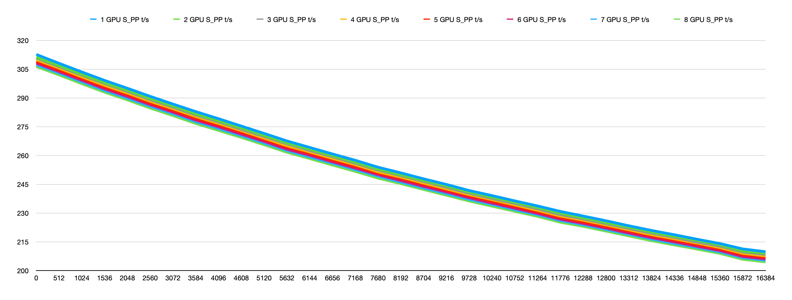
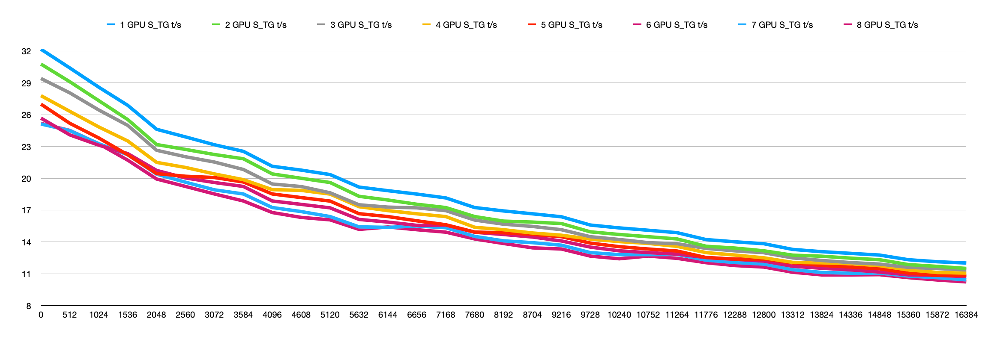

# Snowpiercer 15B MultiGPU test

# The Numbers

Results chart (lots of numbers)

| |1 GPU| |2 GPU   |  |3 GPU   |  |4 GPU   |  |5 GPU   | |6 GPU   | |7 GPU   | |8 GPU   | |
|------|-----|------|--------|--------|--------|--------|--------|--------|--------|--------|--------|--------|--------|--------|--------|--------|
|N_KV  |S_PP t/s|S_TG t/s|S_PP t/s|S_TG t/s|S_PP t/s|S_TG t/s|S_PP t/s|S_TG t/s|S_PP t/s|S_TG t/s|S_PP t/s|S_TG t/s|S_PP t/s|S_TG t/s|S_PP t/s|S_TG t/s|
|0     |312.66|32.17 |311.24  |30.77   |310.82  |29.41   |309.93  |27.79   |309.05  |26.99   |308.18  |25.67   |307.33  |25.12   |306.39  |25.17   |
|512   |308.04|30.40 |306.77  |29.10   |306.24  |28.05   |305.56  |26.31   |304.54  |25.18   |303.74  |24.09   |302.94  |24.49   |301.98  |24.51   |
|1024  |303.52|28.59 |302.27  |27.32   |301.86  |26.44   |300.98  |24.84   |300.07  |23.80   |299.25  |23.12   |298.38  |23.26   |297.41  |23.25   |
|1536  |299.12|26.88 |297.87  |25.54   |297.47  |24.99   |296.56  |23.52   |295.68  |22.22   |294.75  |22.33   |293.88  |22.22   |292.98  |21.71   |
|2048  |295.03|24.62 |293.89  |23.18   |293.38  |22.64   |292.55  |21.50   |291.68  |20.44   |290.77  |20.74   |289.83  |20.39   |288.97  |19.93   |
|2560  |290.81|23.90 |289.66  |22.72   |289.08  |22.03   |288.25  |21.02   |287.32  |20.19   |286.50  |20.03   |285.64  |19.63   |284.71  |19.23   |
|3072  |286.80|23.16 |285.80  |22.24   |285.15  |21.53   |284.40  |20.41   |283.47  |20.07   |282.60  |19.60   |281.78  |18.91   |280.80  |18.52   |
|3584  |282.87|22.54 |281.64  |21.84   |281.09  |20.83   |280.32  |19.87   |279.34  |19.65   |278.47  |19.23   |277.62  |18.52   |276.67  |17.86   |
|4096  |279.16|21.13 |278.01  |20.41   |277.46  |19.46   |276.71  |18.93   |275.85  |18.52   |274.93  |17.86   |274.03  |17.24   |273.05  |16.77   |
|4608  |275.32|20.77 |274.29  |20.00   |273.60  |19.22   |272.95  |18.86   |272.07  |18.18   |271.12  |17.54   |270.31  |16.86   |269.40  |16.31   |
|5120  |271.50|20.35 |270.43  |19.60   |269.84  |18.63   |269.04  |18.51   |268.27  |17.85   |267.36  |17.21   |266.50  |16.39   |265.58  |16.08   |
|5632  |267.58|19.17 |266.49  |18.30   |266.05  |17.50   |265.09  |17.32   |264.34  |16.66   |263.28  |16.12   |262.59  |15.42   |261.68  |15.18   |
|6144  |264.19|18.83 |263.24  |17.95   |262.60  |17.28   |261.87  |16.95   |261.03  |16.39   |260.14  |15.87   |259.22  |15.37   |258.40  |15.41   |
|6656  |260.80|18.51 |259.88  |17.55   |259.34  |17.21   |258.48  |16.65   |257.56  |15.99   |256.71  |15.56   |255.99  |15.50   |255.02  |15.15   |
|7168  |257.49|18.15 |256.48  |17.24   |255.89  |16.95   |255.19  |16.39   |254.31  |15.62   |253.42  |15.58   |252.65  |15.34   |251.70  |14.92   |
|7680  |253.89|17.24 |252.85  |16.39   |252.40  |16.06   |251.50  |15.38   |250.80  |14.93   |250.00  |14.91   |249.20  |14.52   |248.19  |14.28   |
|8192  |250.94|16.92 |249.93  |15.96   |249.47  |15.67   |248.72  |15.15   |247.96  |14.86   |246.95  |14.70   |246.14  |14.10   |245.32  |13.85   |
|8704  |247.83|16.65 |246.94  |15.87   |246.47  |15.46   |245.64  |14.84   |244.89  |14.71   |243.90  |14.46   |243.07  |13.93   |242.27  |13.44   |
|9216  |244.91|16.37 |244.07  |15.73   |243.39  |15.15   |242.60  |14.63   |241.91  |14.49   |240.99  |14.09   |240.13  |13.69   |239.27  |13.33   |
|9728  |241.73|15.59 |240.90  |14.95   |240.29  |14.49   |239.62  |14.27   |238.89  |13.89   |237.97  |13.51   |237.10  |12.99   |236.25  |12.66   |
|10240 |239.10|15.32 |238.25  |14.70   |237.58  |14.23   |236.98  |14.03   |236.08  |13.55   |235.19  |13.16   |234.48  |12.80   |233.57  |12.41   |
|10752 |236.35|15.10 |235.55  |14.49   |234.96  |13.93   |234.24  |13.86   |233.41  |13.33   |232.52  |12.99   |231.76  |12.80   |230.92  |12.67   |
|11264 |233.70|14.87 |232.86  |14.28   |232.18  |13.83   |231.43  |13.58   |230.63  |13.14   |229.81  |12.85   |229.10  |12.82   |228.25  |12.45   |
|11776 |230.86|14.22 |229.88  |13.59   |229.15  |13.39   |228.44  |12.99   |227.69  |12.53   |226.77  |12.52   |226.09  |12.28   |225.20  |12.04   |
|12288 |228.44|14.01 |227.55  |13.42   |226.94  |13.16   |226.29  |12.76   |225.37  |12.38   |224.58  |12.36   |223.89  |12.06   |223.07  |11.77   |
|12800 |225.99|13.83 |224.96  |13.16   |224.42  |12.98   |223.80  |12.50   |222.97  |12.38   |222.18  |12.19   |221.44  |11.91   |220.60  |11.63   |
|13312 |223.39|13.29 |222.64  |12.75   |221.98  |12.49   |221.28  |12.07   |220.58  |12.02   |219.58  |11.70   |218.95  |11.38   |218.09  |11.14   |
|13824 |220.94|13.08 |220.06  |12.65   |219.50  |12.25   |218.72  |12.03   |218.05  |11.78   |217.15  |11.52   |216.45  |11.12   |215.58  |10.89   |
|14336 |218.71|12.92 |217.89  |12.47   |217.31  |12.05   |216.60  |11.95   |215.82  |11.63   |214.98  |11.36   |214.18  |11.05   |213.39  |10.89   |
|14848 |216.35|12.76 |215.67  |12.32   |214.87  |11.91   |214.34  |11.76   |213.53  |11.47   |212.69  |11.16   |212.05  |11.06   |211.21  |10.91   |
|15360 |214.11|12.32 |213.42  |11.86   |212.75  |11.60   |212.00  |11.36   |211.29  |11.05   |210.45  |10.89   |209.75  |10.78   |208.97  |10.63   |
|15872 |211.31|12.13 |210.18  |11.69   |209.72  |11.49   |209.00  |11.12   |208.20  |10.85   |207.36  |10.84   |206.73  |10.63   |205.89  |10.41   |
|16384 |209.87|12.01 |209.00  |11.50   |208.40  |11.36   |207.69  |11.06   |206.98  |10.83   |206.11  |10.73   |205.41  |10.42   |204.56  |10.23   |

 

# Graph

## Prompt Processing:

As we can see here, the default behaviour to evenly split all the tensors over available cards results in a small decrease in performance.

This will result in more available memory for KV cache, allowing longer context, so there is some benefit to doing this, but it's an important factor for performance.

You can prevent this by specifying which cards are available for use with environment variables like `CUDA_VISIBLE_DEVICES`, `ROCR_VISIBLE_DEVICES` or setting `--device ROCm1,ROCm2...` in llama.cpp.

## Token Generation

Much the same happens for the token generation.

# Further Investigation
- Work out why `-sm row` is not working on my system.
