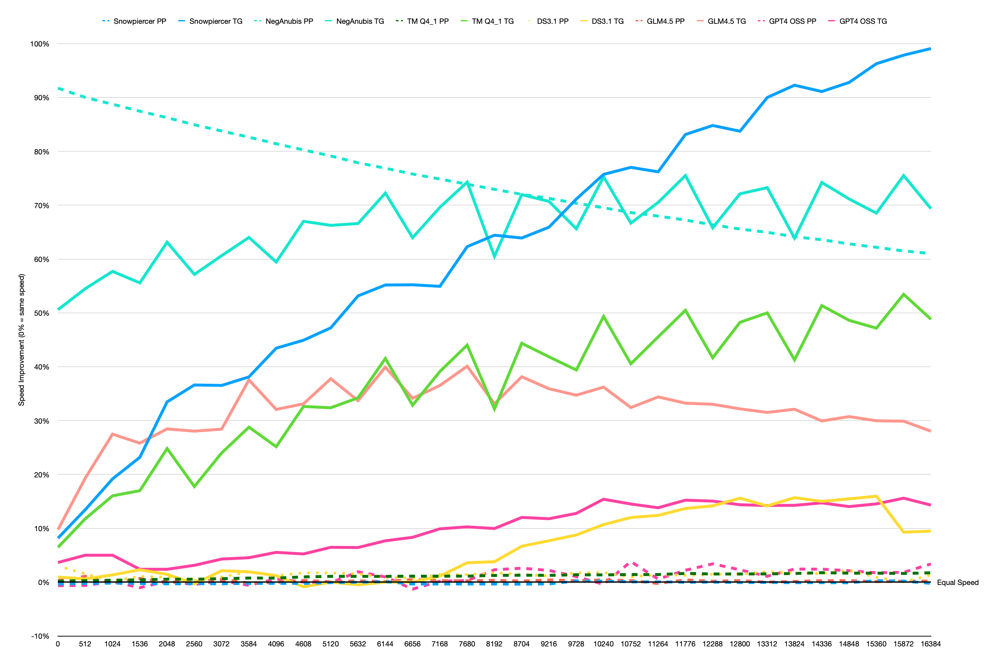

# MI50 performance updates

Thanks to the excellent work of some community members:

- https://github.com/ggml-org/llama.cpp/pull/16291
- https://github.com/ggml-org/llama.cpp/pull/16208
- https://github.com/ggml-org/llama.cpp/pull/15927
- https://github.com/ggml-org/llama.cpp/pull/15982
- https://github.com/ggml-org/llama.cpp/pull/15884

there have been a number of optimisations that should provide some significant improvements to MI50 performance.

But how do they stack up?

# The Numbers

<details>
<summary>Results (lots of numbers!)</summary>

| |Old| |  |  |  |  |  |  | | | | |New        | |  | | | |               | |    | |      | |ratio      | |  | |           |          |              | |    | |      | |
|------|---|------|--------|--------|--------|--------|--------|--------|--------|--------|--------|--------|-----------|--------|---------|--------|--------|--------|----------------------|--------|-----------|--------|-------------|--------|-----------|--------|---------|--------|------------------|-----------------|---------------------|--------|-----------|--------|-------------|--------|
|      |Snowpiercer|      |NegAnubis|        |TM Q4_1 |        |DS 3.1 Q2_K_XL + (+CUDA)|        |GLM4.5 Q4_1|        |gpt4-oss Q8_0|        |Snowpiercer|        |NegAnubis|        |TM Q4_1 |        |DS 3.1 Q2_K_XL (+CUDA)|        |GLM4.5 Q4_1|        |gpt4-oss Q8_0|        |Snowpiercer|        |NegAnubis|        |TM Q4_1           |                 |DS3.1 Q2_K_XL (+CUDA)|        |GLM4.5 Q4_1|        |gpt4-oss Q8_0|        |
|N_KV  |S_PP t/s|S_TG t/s|S_PP t/s|S_TG t/s|S_PP t/s|S_TG t/s|S_PP t/s|S_TG t/s|S_PP t/s|S_TG t/s|S_PP t/s|S_TG t/s|S_PP t/s   |S_TG t/s|S_PP t/s |S_TG t/s|S_PP t/s|S_TG t/s|S_PP t/s              |S_TG t/s|S_PP t/s   |S_TG t/s|S_PP t/s     |S_TG t/s|S_PP t/s   |S_TG t/s|S_PP t/s |S_TG t/s|S_PP t/s          |S_TG t/s         |S_PP t/s             |S_TG t/s|S_PP t/s   |S_TG t/s|S_PP t/s     |S_TG t/s|
|0     |312.66|32.17 |58.27   |6.80    |61.63   |5.11    |21.15   |8.51    |141.16  |12.83   |489.18  |50.73   |311.61     |34.80   |111.72   |10.24   |61.75   |5.44    |21.79                 |8.59    |141.52     |14.08   |486.03       |52.58   |-0.00      |0.08    |0.92     |0.51    |0.00              |0.06             |0.03                 |0.01    |0.00       |0.10    |-0.01        |0.04    |
|512   |308.04|30.40 |57.78   |6.46    |60.42   |4.76    |21.40   |6.73    |135.32  |10.87   |490.81  |47.61   |307.30     |34.49   |109.79   |9.98    |60.59   |5.32    |21.73                 |6.77    |136.79     |12.97   |487.78       |49.99   |-0.00      |0.13    |0.90     |0.54    |0.00              |0.12             |0.02                 |0.01    |0.01       |0.19    |-0.01        |0.05    |
|1024  |303.52|28.59 |57.19   |6.10    |59.24   |4.43    |21.37   |4.47    |131.88  |9.57    |483.75  |47.59   |303.00     |34.07   |107.94   |9.62    |59.45   |5.14    |21.41                 |4.53    |131.63     |12.20   |484.20       |49.97   |-0.00      |0.19    |0.89     |0.58    |0.00              |0.16             |0.00                 |0.01    |-0.00      |0.27    |0.00         |0.05    |
|1536  |299.12|26.88 |56.66   |5.92    |58.12   |4.18    |21.16   |3.91    |126.79  |8.91    |476.59  |47.59   |298.34     |33.11   |106.21   |9.21    |58.37   |4.89    |21.39                 |4.00    |127.64     |11.21   |471.70       |48.73   |-0.00      |0.23    |0.87     |0.56    |0.00              |0.17             |0.01                 |0.02    |0.01       |0.26    |-0.01        |0.02    |
|2048  |295.03|24.62 |56.14   |5.64    |57.07   |3.91    |21.04   |3.43    |123.92  |8.47    |471.61  |46.48   |294.12     |32.86   |104.56   |9.20    |57.38   |4.88    |21.23                 |3.48    |123.89     |10.88   |472.38       |47.59   |-0.00      |0.33    |0.86     |0.63    |0.01              |0.25             |0.01                 |0.01    |-0.00      |0.28    |0.00         |0.02    |
|2560  |290.81|23.90 |55.65   |5.53    |56.03   |3.83    |21.02   |3.09    |119.93  |7.74    |468.41  |45.43   |289.96     |32.65   |102.91   |8.69    |56.33   |4.51    |21.08                 |3.08    |120.00     |9.91    |466.33       |46.85   |-0.00      |0.37    |0.85     |0.57    |0.01              |0.18             |0.00                 |-0.00   |0.00       |0.28    |-0.00        |0.03    |
|3072  |286.80|23.16 |55.15   |5.46    |55.03   |3.71    |20.74   |2.83    |115.95  |7.39    |456.84  |44.34   |285.96     |31.62   |101.35   |8.77    |55.38   |4.60    |20.94                 |2.89    |116.56     |9.49    |457.84       |46.24   |-0.00      |0.37    |0.84     |0.61    |0.01              |0.24             |0.01                 |0.02    |0.01       |0.28    |0.00         |0.04    |
|3584  |282.87|22.54 |54.61   |5.14    |53.97   |3.44    |20.53   |2.61    |112.79  |6.55    |459.13  |43.45   |282.19     |31.13   |99.73    |8.43    |54.38   |4.43    |20.92                 |2.66    |112.59     |9.01    |456.46       |45.42   |-0.00      |0.38    |0.83     |0.64    |0.01              |0.29             |0.02                 |0.02    |-0.00      |0.38    |-0.01        |0.05    |
|4096  |279.16|21.13 |54.20   |5.03    |53.13   |3.34    |20.54   |2.48    |109.59  |6.33    |447.19  |42.09   |278.56     |30.31   |98.32    |8.02    |53.53   |4.18    |20.79                 |2.51    |109.54     |8.36    |449.86       |44.42   |-0.00      |0.43    |0.81     |0.59    |0.01              |0.25             |0.01                 |0.01    |-0.00      |0.32    |0.01         |0.06    |
|4608  |275.32|20.77 |53.76   |4.97    |52.16   |3.28    |20.33   |2.31    |106.40  |6.10    |447.27  |41.64   |274.67     |30.10   |96.91    |8.30    |52.67   |4.35    |20.68                 |2.29    |106.74     |8.12    |447.33       |43.82   |-0.00      |0.45    |0.80     |0.67    |0.01              |0.33             |0.02                 |-0.01   |0.00       |0.33    |0.00         |0.05    |
|5120  |271.50|20.35 |53.30   |4.83    |51.27   |3.15    |20.30   |2.20    |103.84  |5.64    |437.19  |40.81   |271.27     |29.96   |95.48    |8.03    |51.82   |4.17    |20.65                 |2.20    |103.92     |7.77    |436.71       |43.45   |-0.00      |0.47    |0.79     |0.66    |0.01              |0.32             |0.02                 |0.00    |0.00       |0.38    |-0.00        |0.06    |
|5632  |267.58|19.17 |52.83   |4.58    |50.36   |2.95    |20.30   |2.05    |100.98  |5.46    |431.19  |39.97   |267.52     |29.36   |93.97    |7.63    |50.90   |3.96    |20.61                 |2.04    |101.22     |7.30    |439.47       |42.54   |-0.00      |0.53    |0.78     |0.67    |0.01              |0.34             |0.02                 |-0.00   |0.00       |0.34    |0.02         |0.06    |
|6144  |264.19|18.83 |52.43   |4.54    |49.59   |2.89    |20.26   |1.96    |98.47   |5.01    |431.09  |39.20   |264.43     |29.22   |92.73    |7.82    |50.12   |4.09    |20.44                 |1.96    |98.59      |7.01    |435.27       |42.21   |0.00       |0.55    |0.77     |0.72    |0.01              |0.42             |0.01                 |0.00    |0.00       |0.40    |0.01         |0.08    |
|6656  |260.80|18.51 |52.02   |4.44    |48.79   |2.83    |20.17   |1.87    |95.91   |4.95    |430.08  |38.44   |259.90     |28.73   |91.44    |7.28    |49.33   |3.76    |20.32                 |1.87    |96.37      |6.64    |424.52       |41.64   |-0.00      |0.55    |0.76     |0.64    |0.01              |0.33             |0.01                 |0.00    |0.00       |0.34    |-0.01        |0.08    |
|7168  |257.49|18.15 |51.59   |4.31    |48.04   |2.71    |19.96   |1.77    |93.72   |4.71    |420.14  |37.58   |256.60     |28.12   |90.21    |7.31    |48.57   |3.77    |20.24                 |1.79    |93.98      |6.43    |420.84       |41.30   |-0.00      |0.55    |0.75     |0.70    |0.01              |0.39             |0.01                 |0.01    |0.00       |0.37    |0.00         |0.10    |
|7680  |253.89|17.24 |51.12   |4.16    |47.23   |2.59    |19.89   |1.67    |91.57   |4.44    |414.54  |37.02   |253.02     |27.98   |88.89    |7.25    |47.76   |3.73    |20.17                 |1.73    |91.79      |6.22    |415.75       |40.82   |-0.00      |0.62    |0.74     |0.74    |0.01              |0.44             |0.01                 |0.04    |0.00       |0.40    |0.00         |0.10    |
|8192  |250.94|16.92 |50.79   |4.10    |46.57   |2.55    |19.85   |1.58    |89.40   |4.38    |407.28  |36.36   |250.07     |27.82   |87.84    |6.58    |47.15   |3.37    |20.19                 |1.64    |89.70      |5.83    |416.62       |39.98   |-0.00      |0.64    |0.73     |0.60    |0.01              |0.32             |0.02                 |0.04    |0.00       |0.33    |0.02         |0.10    |
|8704  |247.83|16.65 |50.38   |4.03    |45.85   |2.48    |19.77   |1.50    |87.59   |4.09    |403.10  |35.70   |246.92     |27.29   |86.66    |6.93    |46.44   |3.58    |20.06                 |1.60    |87.77      |5.65    |413.53       |39.99   |-0.00      |0.64    |0.72     |0.72    |0.01              |0.44             |0.01                 |0.07    |0.00       |0.38    |0.03         |0.12    |
|9216  |244.91|16.37 |49.99   |3.89    |45.21   |2.39    |19.71   |1.43    |85.68   |4.01    |400.34  |35.07   |244.10     |27.16   |85.61    |6.64    |45.78   |3.39    |19.93                 |1.54    |86.02      |5.45    |409.07       |39.20   |-0.00      |0.66    |0.71     |0.71    |0.01              |0.42             |0.01                 |0.08    |0.00       |0.36    |0.02         |0.12    |
|9728  |241.73|15.59 |49.58   |3.81    |44.49   |2.31    |19.58   |1.37    |83.69   |3.86    |396.77  |34.47   |242.25     |26.68   |84.47    |6.31    |45.10   |3.22    |19.92                 |1.49    |83.92      |5.20    |400.85       |38.87   |0.00       |0.71    |0.70     |0.66    |0.01              |0.39             |0.02                 |0.09    |0.00       |0.35    |0.01         |0.13    |
|10240 |239.10|15.32 |49.24   |3.76    |43.92   |2.27    |19.53   |1.31    |81.99   |3.70    |397.78  |33.90   |239.56     |26.92   |83.47    |6.59    |44.51   |3.39    |19.88                 |1.45    |82.33      |5.04    |396.19       |39.12   |0.00       |0.76    |0.70     |0.75    |0.01              |0.49             |0.02                 |0.11    |0.00       |0.36    |-0.00        |0.15    |
|10752 |236.35|15.10 |48.87   |3.69    |43.27   |2.22    |19.46   |1.25    |80.38   |3.64    |383.87  |33.57   |236.47     |26.73   |82.41    |6.15    |43.88   |3.12    |19.65                 |1.40    |80.61      |4.82    |398.53       |38.44   |0.00       |0.77    |0.69     |0.67    |0.01              |0.41             |0.01                 |0.12    |0.00       |0.32    |0.04         |0.15    |
|11264 |233.70|14.87 |48.49   |3.56    |42.70   |2.13    |19.38   |1.21    |78.77   |3.46    |390.27  |33.16   |233.84     |26.20   |81.45    |6.07    |43.30   |3.10    |19.65                 |1.36    |78.58      |4.65    |392.51       |37.74   |0.00       |0.76    |0.68     |0.71    |0.01              |0.46             |0.01                 |0.12    |-0.00      |0.34    |0.01         |0.14    |
|11776 |230.86|14.22 |48.04   |3.51    |41.98   |2.08    |19.37   |1.17    |77.02   |3.40    |381.09  |32.59   |230.82     |26.04   |80.34    |6.16    |42.66   |3.13    |19.61                 |1.33    |77.34      |4.53    |389.49       |37.55   |-0.00      |0.83    |0.67     |0.75    |0.02              |0.50             |0.01                 |0.14    |0.00       |0.33    |0.02         |0.15    |
|12288 |228.44|14.01 |47.79   |3.45    |41.54   |2.04    |19.29   |1.13    |75.65   |3.27    |375.84  |32.16   |228.46     |25.89   |79.50    |5.72    |42.17   |2.89    |19.57                 |1.29    |75.78      |4.35    |388.60       |37.00   |0.00       |0.85    |0.66     |0.66    |0.02              |0.42             |0.01                 |0.14    |0.00       |0.33    |0.03         |0.15    |
|12800 |225.99|13.83 |47.45   |3.37    |40.98   |1.99    |19.18   |1.09    |74.26   |3.17    |375.24  |31.80   |225.83     |25.41   |78.56    |5.80    |41.60   |2.95    |19.46                 |1.26    |74.47      |4.19    |383.83       |36.37   |-0.00      |0.84    |0.66     |0.72    |0.02              |0.48             |0.01                 |0.16    |0.00       |0.32    |0.02         |0.14    |
|13312 |223.39|13.29 |47.09   |3.29    |40.46   |1.92    |19.07   |1.06    |72.90   |3.11    |373.18  |31.48   |223.29     |25.25   |77.68    |5.70    |41.08   |2.88    |19.44                 |1.21    |72.90      |4.09    |377.26       |35.96   |-0.00      |0.90    |0.65     |0.73    |0.02              |0.50             |0.02                 |0.14    |0.00       |0.32    |0.01         |0.14    |
|13824 |220.94|13.08 |46.71   |3.24    |39.87   |1.89    |19.01   |1.02    |71.58   |2.99    |367.50  |31.06   |220.72     |25.15   |76.67    |5.31    |40.51   |2.67    |19.33                 |1.18    |71.67      |3.95    |376.44       |35.49   |-0.00      |0.92    |0.64     |0.64    |0.02              |0.41             |0.02                 |0.16    |0.00       |0.32    |0.02         |0.14    |
|14336 |218.71|12.92 |46.41   |3.18    |39.37   |1.85    |18.91   |1.00    |70.26   |2.94    |364.71  |30.64   |218.52     |24.69   |75.92    |5.54    |40.06   |2.80    |19.21                 |1.15    |70.45      |3.82    |373.48       |35.15   |-0.00      |0.91    |0.64     |0.74    |0.02              |0.51             |0.02                 |0.15    |0.00       |0.30    |0.02         |0.15    |
|14848 |216.35|12.76 |46.09   |3.12    |38.90   |1.81    |18.81   |0.97    |69.09   |2.83    |360.29  |30.29   |216.11     |24.60   |75.04    |5.34    |39.55   |2.69    |19.23                 |1.12    |69.28      |3.70    |367.93       |34.54   |-0.00      |0.93    |0.63     |0.71    |0.02              |0.49             |0.02                 |0.15    |0.00       |0.31    |0.02         |0.14    |
|15360 |214.11|12.32 |45.76   |3.05    |38.44   |1.76    |18.81   |0.94    |67.84   |2.77    |359.59  |29.87   |214.70     |24.18   |74.21    |5.14    |39.08   |2.59    |18.98                 |1.09    |67.91      |3.60    |365.84       |34.21   |0.00       |0.96    |0.62     |0.69    |0.02              |0.47             |0.01                 |0.16    |0.00       |0.30    |0.02         |0.15    |
|15872 |211.31|12.13 |45.30   |3.02    |37.84   |1.74    |18.87   |0.97    |66.45   |2.71    |354.03  |29.44   |211.71     |24.00   |73.16    |5.30    |38.45   |2.67    |18.88                 |1.06    |66.56      |3.52    |360.51       |34.03   |0.00       |0.98    |0.62     |0.75    |0.02              |0.53             |0.00                 |0.09    |0.00       |0.30    |0.02         |0.16    |
|16384 |209.87|12.01 |45.12   |2.97    |37.51   |1.70    |18.67   |0.95    |65.48   |2.64    |351.41  |29.15   |209.41     |23.91   |72.65    |5.03    |38.16   |2.53    |18.92                 |1.04    |65.61      |3.38    |363.27       |33.32   |-0.00      |0.99    |0.61     |0.69    |0.0173287123433751|0.488235294117647|0.01                 |0.09    |0.00       |0.28    |0.03         |0.14    |

</details>
<br>

# Configuration

The older version is:
```
commit 1eeb523c3e0c7ffbd59469f5463dcbdecba3535e (tag: b6529, origin/master, origin/HEAD)
Author: Giuseppe Scrivano <gscrivan@redhat.com>
Date:   Sun Sep 21 08:31:55 2025 +0200
```

The newer version is:
```
commit b887d2f3413ac231e3cb5925260c39902af4a70c (origin/master, origin/HEAD)
Author: Sigbjørn Skjæret <sigbjorn.skjaeret@scala.com>
Date:   Sun Sep 28 23:15:03 2025 +0200
```

Configure arguments are:
```bash
HIPCXX="$(hipconfig -l)/clang" HIP_PATH="$(hipconfig -R)" CUDACXX="/usr/local/cuda-13.0/bin/nvcc" cmake -S . -B build -DGGML_HIP=ON -DAMDGPU_TARGETS=gfx906 -DCMAKE_BUILD_TYPE=Release -DGGML_RPC=ON -DLLAMA_CURL=OFF -DGGML_CUDA=ON -DGGML_BACKEND_DL=ON -DGGML_CPU_ALL_VARIANTS=ON -DCMAKE_CUDA_ARCHITECTURES=86 -DGGML_CUDA_FA_ALL_QUANTS=true -DGGML_SCHED_MAX_COPIES=1
```

Model specific settings:
- Snowpiercer (15B) was run on 1 MI50 in Q6_K
- Negative Anubis (70B) was run in Q4_K_S, 8x MI50
- Twilight Miqu (146B) was run in Q4_1, 8x MI50
- DeepSeek 3.1 (671B A37B) was run in Q2_K_XL, 8xMI50, 1x3090 (it does not actually fit across 8x MI50 despite being <256GB unless you split layers across multiple GPUs)
- GLM4.5 (355B A32B) was run in Q4_1, 8x MI50
- GPT4 OSS (120B A5.1B) was run in Q8_0, 3x MI50 (not its native MXFP4)

# Graph



Overall: These numbers are in percentage compared to the old i.e. `((new - old) / old)`. 0% means same speed as before. +100% means twice as fast.

Nothing is now slower by any statistically significant degree.

Comparing by model:

- Snowpiercer (blue) - no improvement on prompt processing, but a huge increase in token generation that only gets better as context increases. You can see [here](mi50-vs-3090.md) how it diminishes slower.
- Negative Anubis (cyan) - this one, unusually does get a fairly significant boost in prompt processing. I double-checked the benchmark, because it seems none of the others really did. Inference is also up by quite a bit more than the others at short contexts. This one looks more like it was fixing a performance bug than providing a similar speedup to the others.
- Twilight Miqu (green) - this one's interesting to benchmark because it's one of the biggest dense models out there - the product of some absolutely crazy merge work between a bunch of different models. This one got a slight boost at prompt processing and a moderate inference boost.
- DeepSeek 3.1 (yellow) - A small ~10% boost to token generation. This one still seems to use a ton of CPU even when fully offloaded so I think there's some sort of problem going on here.
- GLM4.5 (pink) - A quite good performance increase, but it was already quite quick before.
- GPT4-OSS (magenta) - A bit more performance increase at lower contexts than GLM4.5.
